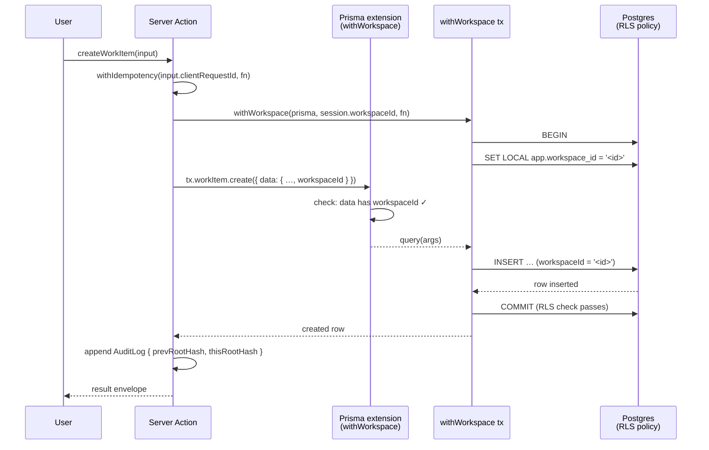

# ORVIX — Architecture (v0.2 / Phase 0 closeout)

> Companion to `PHASE-0-STATUS.md`. This file is the runtime picture;
> the status doc is the gate report. Diagrams are in Mermaid — render
> in GitHub, VS Code, or `mermaid-cli`.

## 1. Component diagram

```mermaid
flowchart LR
  subgraph client[Browser]
    UI[7-destination AppShell<br/>+ AI Assistant Bar]
  end

  subgraph web[apps/web — Next.js 15]
    SA[Server Actions<br/>+ withIdempotency]
    AUTH[requireSession stub<br/>Phase 1: Auth.js v5]
    AUDIT[Audit log writer<br/>Merkle chain]
  end

  subgraph ai[apps/ai — Fastify 3001]
    RUN[POST /run]
    HEALTH[GET /healthz]
  end

  subgraph runtime[packages/ai-runtime]
    PLAN[Planner<br/>Phase 0: rule-based]
    VER[Verifier<br/>Phase 0: rule-based]
    APP[Approver<br/>execute|queue|block|cooldown]
    TOOLS[Tool Registry<br/>allowList-gated]
    MEM[Memory<br/>3 layers]
  end

  subgraph core[packages/db]
    EXT[Prisma extension<br/>withWorkspace]
    PRISMA[(Prisma Client)]
  end

  PG[(Postgres 16<br/>+ RLS<br/>+ Merkle audit table)]

  UI -->|Server Action call| SA
  SA -->|requireSession| AUTH
  SA -->|withWorkspace| EXT
  SA -->|persist| AUDIT
  SA -->|HTTP POST| RUN
  UI -->|HTTP GET| RUN

  RUN --> PLAN
  PLAN --> VER
  VER --> APP
  APP --> TOOLS
  APP --> MEM

  TOOLS -.uses.-> EXT
  MEM -.uses.-> EXT
  EXT --> PRISMA
  PRISMA --> PG
  AUDIT --> PG
```

The two load-bearing contracts:

1. **`withWorkspace(prisma, workspaceId, fn)`** — the only place
   `app.workspace_id` is bound for the duration of a transaction.
   The Prisma extension **enforces** `workspaceId` on every
   tenant-scoped query, so the application cannot bypass the
   boundary even by accident.
2. **`AIRunRequest` → `AIRunResult`** — every AI call goes through
   `planner → verifier → approver`, regardless of the routing
   profile. The approver is the *only* function that decides
   `execute | queue | block | cooldown`. The Verifier is rule-based
   in Phase 0 (deterministic, auditable) and the same interface
   accepts an LLM in Phase 1.

## 2. Sequence: an AI Assistant run

```mermaid
sequenceDiagram
  participant U as User
  participant W as apps/web<br/>(Server Action)
  participant A as apps/ai<br/>(POST /run)
  participant P as Planner
  participant V as Verifier
  participant AP as Approver
  participant DB as Postgres<br/>(RLS-bound)

  U->>W: clicks "Summarize"<br/>(clientRequestId, workItemId)
  W->>W: requireSession()<br/>(workspaceId, userId, roleId)
  W->>A: POST /run {<br/>workspaceId, routingProfile, kind, payload}
  A->>P: plan(request)
  P-->>A: { proposedPayload, confidence, toolCalls, traceId }
  A->>V: runVerifier({<br/>request, proposedPayload, actionClass })
  V-->>A: { verdict, confidence, rationale? }
  A->>AP: approve({ request, plannerConfidence, verifier, costMeter })
  AP-->>A: { decision, confidenceLabel, rationale }
  A-->>W: AIRunResult
  alt decision == execute
    W->>DB: withWorkspace(write)
    DB-->>W: OK + audit row
  else decision == queue_for_approval
    W->>DB: write ApprovalQueue row<br/>(visible in /ai Approvals tab)
  else decision == block
    W-->>U: "Action blocked: <rationale>"
  else decision == cooldown
    W-->>U: "Cost cap reached; will resume at 00:00 UTC"
  end
  W-->>U: result envelope
```

## 3. Sequence: a write that must be tenant-scoped



If the Server Action **forgets** the `workspaceId` in `data`, the
Prisma extension rejects with `TenantIsolationError` *before* any
SQL hits Postgres. Layer 1 (app) and Layer 2 (DB) both run.

## 4. Why this is the right shape

- **No "tenant middleware" pattern.** The v0.1 `withTenant` request
  middleware was removed. Tenant binding is *transactional* and
  *explicit*, not contextual. This eliminates the entire class of
  "request leaked into a background job" bugs.
- **Two layers, not one.** The Prisma extension alone is a soft
  guard (a developer can still write raw SQL that bypasses it).
  Postgres RLS is the hard guard. Either layer alone is
  insufficient; together they're load-bearing.
- **Approver is the only decision-maker.** No code path executes
  AI work without going through `approve()`. The Verifier is
  swappable without changing this.
- **The "AI Assistant" is one object per workspace, not many.** Eight
  internal routing profiles are bound to a single assistant. This
  is the contract: there is no "AI Employee" object in the schema.

## 5. Where Phase 0 stops and Phase 1 starts

- **Phase 0** ships the contracts, the types, the deterministic
  rule-based Planner/Verifier, the in-memory idempotency + audit
  stores, the stub auth, and the SQL/RLS migration. Everything
  builds, types, tests, and lints.
- **Phase 1** swaps the stubs: Auth.js, model providers, Redis,
  Postgres audit. The interface contracts from Phase 0 are
  preserved — call sites do not change. See `PHASE-0-STATUS.md`
  §8 for the first RFC in the queue.
