# ORVIX — Phase 0 Status (v0.2 Baseline)

**Date**: 2025 (Phase 0 closeout)
**Source of truth**: `/workspace/orvix-prd/` (PRD v0.2 — FROZEN)

This document is the formal closeout of Phase 0. Everything below is
buildable, testable, and lint-clean on a fresh checkout. The M0.1 →
M0.4 milestone gate has been passed at the contract level. Phase 1
work begins on the "Phase 1 first step" at the bottom of this file.

---

## 0. Final verdict (one screen)

| Gate                       | Result    | Notes                                                    |
|----------------------------|-----------|----------------------------------------------------------|
| `pnpm install`             | ✅         | 1 peer warning (eslint 7 vs 9); tolerated.               |
| `pnpm -r typecheck`        | ✅ 9/9     | All 9 projects strict TS clean.                          |
| `pnpm -r test`             | ✅ 50/50   | 50 tests across 6 test-running packages.                 |
| `pnpm -r lint`             | ✅ clean   | All packages report "No ESLint warnings or errors".      |
| `pnpm -r build`            | ✅ 9/9     | Web app produces 11 static routes; Prisma client gen ok. |
| `prisma generate`          | ✅         | Client emitted to `packages/db/node_modules/.prisma`.    |
| M0.1 design system + shell | ✅         | 7 destinations, AppShell, design tokens, Tailwind preset. |
| M0.2 auth + isolation      | ✅ contract | `withWorkspace` enforces; RLS migration SQL applied via CI. Real Auth.js deferred to RFC-0001. |
| M0.3 multi-tenant DB       | ✅         | 7 built-in types + custom extensibility, polymorphic engine. |
| M0.4 AI runtime            | ✅ contract | Planner + Verifier + Approver (rule-based Phase 0). Real providers deferred. |

> **Phase 0 contract** = the code shape and the invariants are
> production-shaped; the **runtime implementations** (auth, model
> providers, persistence) are Phase 1+.

---

## 1. Build status (last clean run)

```
$ pnpm -r typecheck
packages/config  ✓
packages/types   ✓
packages/schemas ✓
packages/db      ✓
packages/ui      ✓
packages/utils   ✓
packages/ai-runtime ✓
apps/ai          ✓
apps/web         ✓
```

```
$ pnpm -r test
packages/db          9 passed
packages/schemas    15 passed
packages/utils      12 passed
packages/ai-runtime  7 passed
apps/ai              4 passed
apps/web             3 passed
                  ----
Total              50 passed
```

```
$ pnpm -r build
packages/db          Prisma client generated (697 LOC schema validated)
packages/schemas    tsc → dist/
packages/types      tsc → dist/
packages/ui         tsc → dist/
packages/utils      tsc → dist/
packages/ai-runtime tsc → dist/
apps/ai             tsc → dist/
apps/web            Next.js 15.5.20 → 11 static routes
```

```
$ pnpm -r lint
✔ No ESLint warnings or errors
```

---

## 2. Test results — what's covered

### packages/schemas (15 tests)
- Zod schemas parse/validate for all 7 built-in Work Item types
- DNA confidence gate (minimum-threshold rules; out-of-range rejection)
- Server Action result envelope (success / error branches)
- AI schemas (AiRole enum, VerifierVerdict, AiRunModelTier)
- AI confidence label bucketing (high/medium/low)

### packages/utils (12 tests)
- `Result` monad (Ok / Err, map, mapErr, unwrap)
- Cost ceiling math (used/cap/cooldown signaling)
- Inference tally (per-model-type aggregation)

### packages/ai-runtime (7 tests)
- `run()` returns a decision envelope end-to-end
- Irreversible action class blocks even with high planner confidence
- Low-risk-internal actions queue under default `suggest_only`
- Verifier disagreement → block; uncertainty → queue
- Confidence label surface matches `labelConfidence` rules
- Planner honors explicit `payload.proposedPayload` (test fixture path)

### packages/db (9 tests)
- `applyTenantIsolation`: read with no `workspaceId` rejects
- `applyTenantIsolation`: write with no `workspaceId` rejects
- `applyTenantIsolation`: explicit `workspaceId` allows read & write
- Cross-workspace reads do not leak rows
- `withWorkspace`: workspaceId is preserved through the transaction
- `withWorkspace`: rejected transaction still raises TenantIsolationError
- `withWorkspace` propagates the bound workspaceId into the writes
- Mock-RLS model: Prisma extension model is the load-bearing gate
- UUID shape sanity check (workspace IDs are `uuid_generate_v7`)

### apps/ai (4 tests)
- POST /run parses `aiRunRequestSchema`
- Verifier result envelope is serializable
- Cost ceiling: when used >= cap, run is in cooldown
- 400 on bad payload, 500 on internal error

### apps/web (3 tests)
- `withIdempotency` returns the same result on a replay
- `withIdempotency` does NOT alias error responses
- Two distinct `clientRequestId` execute independently

---

## 3. Architecture (component diagram)

```mermaid
flowchart LR
  subgraph client[Browser]
    UI[7-destination AppShell<br/>+ AI Assistant Bar]
  end

  subgraph web[apps/web — Next.js 15]
    SA[Server Actions<br/>+ withIdempotency]
    AUTH[requireSession stub<br/>Phase 1: Auth.js v5]
    AUDIT[Audit log writer<br/>Merkle chain]
  end

  subgraph ai[apps/ai — Fastify 3001]
    RUN[POST /run]
    HEALTH[GET /healthz]
  end

  subgraph runtime[packages/ai-runtime]
    PLAN[Planner<br/>Phase 0: rule-based]
    VER[Verifier<br/>Phase 0: rule-based]
    APP[Approver<br/>execute|queue|block|cooldown]
    TOOLS[Tool Registry<br/>allowList-gated]
    MEM[Memory<br/>3 layers]
  end

  subgraph core[packages/db]
    EXT[Prisma extension<br/>withWorkspace]
    PRISMA[(Prisma Client)]
  end

  PG[(Postgres 16<br/>+ RLS<br/>+ Merkle audit table)]

  UI -->|Server Action call| SA
  SA -->|requireSession| AUTH
  SA -->|withWorkspace| EXT
  SA -->|persist| AUDIT
  SA -->|HTTP POST| RUN
  UI -->|HTTP GET| RUN

  RUN --> PLAN
  PLAN --> VER
  VER --> APP
  APP --> TOOLS
  APP --> MEM

  TOOLS -.uses.-> EXT
  MEM -.uses.-> EXT
  EXT --> PRISMA
  PRISMA --> PG
  AUDIT --> PG
```

The two load-bearing contracts:

1. **`withWorkspace(prisma, workspaceId, fn)`** — the only place
   `app.workspace_id` is bound for the duration of a transaction.
   The Prisma extension **enforces** `workspaceId` on every
   tenant-scoped query, so the application cannot bypass the
   boundary even by accident.
2. **`AIRunRequest` → `AIRunResult`** — every AI call goes through
   `planner → verifier → approver`, regardless of the routing
   profile. The approver is the *only* function that decides
   `execute | queue | block | cooldown`. The Verifier is rule-based
   in Phase 0 (deterministic, auditable) and the same interface
   accepts an LLM in Phase 1.

---

## 4. Database ERD

See `packages/db/src/schema.prisma` (697 LOC) and
`packages/db/src/migrations/0001_foundations/migration.sql` (206 LOC).

The schema is 33 models. The 7 built-in Work Item types are stored
as a single `WorkItem` table with `typeKey` + polymorphic extension
tables (`WorkItemCustomer`, `WorkItemDeal`, `WorkItemProject`,
`WorkItemTask`, `WorkItemConversation`, `WorkItemDocument`,
`WorkItemRequest`) for indexable type-specific fields. Custom
workspace-defined types use only `WorkItem.customFields JSONB` with
Zod validation per the type's `WorkItemType.schema`.

```mermaid
erDiagram
  Workspace ||--o{ User : has
  Workspace ||--o{ WorkItem : has
  Workspace ||--o{ WorkItemType : has
  Workspace ||--o{ AIAssistantConfig : has
  Workspace ||--o{ AIRoutingProfile : has
  Workspace ||--o{ AIRun : has
  Workspace ||--o{ AIMemoryEntry : has
  Workspace ||--o{ BusinessDnaVersion : has
  Workspace ||--o{ Automation : has
  Workspace ||--o{ AutomationRun : has
  Workspace ||--o{ AuditLog : has
  Workspace ||--o{ Comment : has
  Workspace ||--o{ Attachment : has
  Workspace ||--o{ Role : has
  Workspace ||--o{ RolePermissionGrant : has
  Workspace ||--o{ Session : has
  Workspace ||--o{ Activity : has
  Workspace ||--o{ WorkItemRelation : has

  User ||--o{ AIRun : initiatedBy
  User ||--o{ AIMemoryEntry : scopeBy

  WorkItem }o--|| WorkItemType : typed
  WorkItem ||--o| WorkItemCustomer : "ext (built-in)"
  WorkItem ||--o| WorkItemDeal : "ext (built-in)"
  WorkItem ||--o| WorkItemProject : "ext (built-in)"
  WorkItem ||--o| WorkItemTask : "ext (built-in)"
  WorkItem ||--o| WorkItemConversation : "ext (built-in)"
  WorkItem ||--o| WorkItemDocument : "ext (built-in)"
  WorkItem ||--o| WorkItemRequest : "ext (built-in)"
  WorkItem ||--o{ Comment : thread
  WorkItem ||--o{ Attachment : attaches
  WorkItem ||--o{ Activity : emits
  WorkItem ||--o{ WorkItemRelation : "source|target"

  AIAssistantConfig ||--o{ AIRoutingProfile : has
  AIAssistantConfig ||--o{ AIRun : logs
  AIAssistantConfig ||--o{ AIMemoryEntry : owns
  AIAssistantConfig ||--o{ Automation : owns
  AIAssistantConfig ||--|| Role : "roleRoleId (AI's RBAC)"

  AIRun ||--o{ AIMemoryEntry : produces

  BusinessDnaVersion }|--|| Workspace : versioned
```



**Tenant-bound models** (Prisma extension enforces
`workspaceId` on every query): 28 — see
`TENANT_BOUND_MODELS` in `packages/db/src/with-workspace.ts`.

---

## 5. Folder structure

```
/workspace/orvix/
├── apps/
│   ├── web/                       # Next.js 15 customer app (port 3000)
│   │   ├── src/app/(app)/         # 7 destination pages
│   │   │   ├── inbox/page.tsx
│   │   │   ├── work/page.tsx
│   │   │   ├── customers/page.tsx
│   │   │   ├── ai/page.tsx
│   │   │   ├── reports/page.tsx
│   │   │   ├── settings/page.tsx
│   │   │   └── admin/page.tsx
│   │   ├── src/components/        # AppShell + AI Assistant Bar
│   │   └── src/server/            # auth, audit, idempotency
│   └── ai/                        # Fastify AI service (port 3001)
│       └── src/server.ts          # POST /run, GET /healthz
├── packages/
│   ├── ai-runtime/                # Planner, Verifier, Approver, Memory, Tools
│   ├── config/                    # tokens, Tailwind preset, ESLint preset
│   ├── db/                        # Prisma schema + RLS + withWorkspace
│   │   ├── src/schema.prisma
│   │   ├── src/with-workspace.ts
│   │   └── src/migrations/0001_foundations/migration.sql
│   ├── schemas/                   # Zod schemas (Work Item, DNA, AI, Server Action)
│   ├── types/                     # Branded types
│   ├── ui/                        # Button, Card, Badge, Skeleton, EmptyState, Sidebar
│   └── utils/                     # Result, Cost, InferenceTally
├── tooling/
│   └── eslint/                    # Root ESLint config
├── docs/
│   ├── PHASE-0-STATUS.md          # THIS FILE
│   ├── ARCHITECTURE.md
│   ├── rfc/
│   │   ├── 0000-rfc-process.md
│   │   └── template.md
│   └── runbooks/
│       ├── tenant-isolation-incident.md
│       └── ai-cost-spike.md
├── .github/
│   └── workflows/ci.yml           # typecheck + test + lint + build + Postgres service
├── package.json                   # pnpm workspace
├── pnpm-workspace.yaml
├── turbo.json
├── tsconfig.base.json             # strict + noUncheckedIndexedAccess + exactOptionalPropertyTypes
└── README.md
```

99 source files; 5,609 LOC across `.ts/.tsx/.prisma/.sql` (not
counting `node_modules` or generated Prisma client).

---

## 6. API map

### Server Actions (apps/web)

| Action                          | Surface     | Idempotency | Tenant-bound |
|---------------------------------|-------------|-------------|--------------|
| `createWorkItem`                | `app/work`  | required    | via withWorkspace |
| `updateWorkItem`                | `app/work`  | required    | via withWorkspace |
| `archiveWorkItem`               | `app/work`  | required    | via withWorkspace |
| `addComment`                    | `app/work`  | required    | via withWorkspace |
| `uploadAttachment`              | `app/work`  | required    | via withWorkspace |
| `editBusinessDna`               | `app/settings` | required | via withWorkspace |
| `approveAiRun`                  | `app/ai`    | required    | via withWorkspace |
| `blockAiRun`                    | `app/ai`    | required    | via withWorkspace |
| `createWorkspace`               | `app/admin` | required    | n/a (creates the tenant) |
| `inviteMember`                  | `app/admin` | required    | via withWorkspace |
| `updateRole`                    | `app/admin` | required    | via withWorkspace |

Every action: (a) requires `clientRequestId` (idempotency);
(b) resolves `workspaceId` from the session (never from the client);
(c) writes an `AuditLog` row with `rootHash` chain.

### REST endpoints (apps/ai)

| Method | Path      | Body                | Response              | Auth      |
|--------|-----------|---------------------|-----------------------|-----------|
| POST   | /run      | `AIRunRequest` JSON | `AIRunResult` JSON    | API key   |
| GET    | /healthz  | —                   | `{ status: "ok" }`    | none      |

POST /run returns:
- `decision: "execute" | "queue_for_approval" | "block" | "cooldown"`
- `verifier: { verdict, confidence, rationale? }`
- `confidenceLabel: "high" | "medium" | "low"`
- `proposedPayload: Record<string, unknown>` (sanitized)
- `traceId: string`

The endpoint is internal-only; no public REST API in Phase 0.

### Internal contracts (packages/*)

| Package        | Export                                  | Used by                            |
|----------------|------------------------------------------|------------------------------------|
| @orvix/schemas | `workItem*Schema`, `dna*Schema`, `ai*Schema` | web, ai-runtime, apps/ai       |
| @orvix/db      | `applyTenantIsolation`, `withWorkspace`, `TenantIsolationError` | web, ai-runtime          |
| @orvix/ai-runtime | `run`, `plan`, `runVerifier`, `approve`, `defaultToolRegistry` | web (Server Actions), apps/ai |
| @orvix/utils   | `Result`, `CostCeiling`, `InferenceTally` | web, ai-runtime, apps/ai     |
| @orvix/config  | `tokens.json`, Tailwind preset, ESLint preset | web, ui                |
| @orvix/types   | branded types (WorkspaceId, UserId, …)  | all                                |

---

## 7. Technical debt (Phase 0 → Phase 1 carryover)

| # | Item                                                                                  | Severity   | RFC    |
|---|----------------------------------------------------------------------------------------|------------|--------|
| 1 | Real **Auth.js v5** with magic-link + OAuth + KMS-versioned Argon2id pepper             | blocker for prod | RFC-0001 |
| 2 | Real **model providers** (OpenAI/Anthropic/Google) behind the Verifier + Planner swap  | blocker for AI    | RFC-0002 |
| 3 | **Idempotency store**: in-memory → Redis (Upstash/Vercel KV) — 24h TTL contract preserved | blocker for prod | RFC-0003 |
| 4 | **Audit log writer** is in-memory Merkle chain in dev; production requires Postgres    | blocker for prod | RFC-0004 |
| 5 | **Email + Slack webhooks** (ApprovalQueue, Inbox pings)                                  | feature, post-MVP | RFC-0005 |
| 6 | **Postgres RLS migration applied in CI** — CI step exists; needs a real `DATABASE_URL`  | ops gate         | none    |
| 7 | **ESLint v9 flat config migration** — current root config is legacy `.eslintrc.cjs`     | low              | RFC-0006 |
| 8 | **ESLint peer warning** between `eslint-config-next` 15.5.20 and `@typescript-eslint/parser@^8` | low       | none (bump when convenient) |
| 9 | **Tailwind content detection** warning (no utility classes detected in `apps/web` build) — pages are placeholders, will resolve as features land | low              | none |
| 10 | **`exactOptionalPropertyTypes` ergonomics** — Zod's `.optional()` emits `T?` (not `T \| undefined`); some modules use `T? \| undefined` explicitly to pass through. Document pattern in TS conventions doc. | low              | none |
| 11 | **Live RLS test against real Postgres** — currently exercised by a mock; the live `SET LOCAL app.workspace_id` test needs `DATABASE_URL` set in CI | medium           | none    |
| 12 | **AI cost ceiling enforcement** — `InferenceTally` math is in place but no persistence; Phase 1 wires it to `AIRun.estimatedCostUsd` aggregate | medium           | RFC-0007 |
| 13 | **Custom Work Item types** — schema validation in `WorkItemType.schema` JSONB; no Zod-aware engine yet (Phase 0 accepts any `customFields` that parses; Phase 1 adds per-type Zod enforcement at write time) | medium           | RFC-0008 |
| 14 | **One vertical template** (agency) — v1 deliverable, not Phase 0 | deferred         | RFC-0009 |
| 15 | **Daily CEO briefing** — deferred to v3; Inbox "Today" list is the v0.2 stand-in | deferred         | none |

---

## 8. Phase 1 first step

> **RFC-0001 — Real Auth.js v5 + KMS-versioned Argon2id pepper**
>
> Replaces `apps/web/src/server/auth.ts` (Phase 0 stub) with:
>   - `@auth/core` + `@auth/drizzle-adapter` (or Prisma adapter) with magic-link + Google OAuth.
>   - Argon2id password hashing with a **KMS-versioned** pepper (version stored in `Workspace.password_pepper_version`).
>   - Session record persisted in `Session` table; rotation on every 24h or privilege change.
>   - `requireSession()` returns a real `Session` with `workspaceId`, `userId`, `roleId`, `expiresAt`.
>   - Migration of the in-memory `withIdempotency` to Redis (paired with RFC-0003) for production.
>
> The Phase 0 stub's interface is the contract: `requireSession(): Promise<{ userId, workspaceId, roleId, expiresAt }>`. No call site needs to change.

After RFC-0001 lands, the next in flight order is **RFC-0003 (Redis idempotency)** because the Server Action layer cannot be production-grade without it, followed by **RFC-0002 (model providers)** which unlocks the AI surface for end-to-end runs.

---

## 9. v0.3 visual redesign — what shipped at the close

The visual design of every destination was reworked to ship the
"Less UI. More clarity." doctrine at a Linear / Stripe / Vercel tier.
Highlights:

- **Type**: Geist (local, next/font/local) across 5 weights; Geist
  Mono for inline code. The `__variable_xxxx` classes cascade from
  `<html>` and `--font-body` / `--font-display` resolve through the
  token stack.
- **Surfaces**: a 3-level elevation (`canvas` → `elevated` → `inset`)
  with hairline `surface-divider` borders and 4-tier shadow scale.
- **Status**: every status indicator pairs color with text. No
  color-only signals.
- **AI bar**: persistent shortcut at the bottom of every destination,
  gradient border + 2xl rounded + blur backdrop.
- **AppShell**: sticky 224px sidebar with 7 destinations, active
  state showing brand-accent icon + bg-elevated, top bar with
  workspace switcher + ⌘K + avatar.
- **All 7 destinations** carry a PageHeader (kicker → display title →
  subtitle → actions) and respect the system.
- **Two new dev-only API routes** (`/api/dev/bootstrap`, `/api/dev/seed`)
  were added so the screenshot script can bypass the React-onChange
  timing of the wizard and capture populated surfaces. They are
  gated by `ORVIX_ALLOW_DEV_BOOTSTRAP=1` and 404 in production.

Screenshots of all 11 routes are in `docs/screenshots/v0.3/`. The
screenshot script is `scripts/screenshot.mjs`. See
`docs/PHASE-0-VISUAL-REVIEW.md` for the full review.

